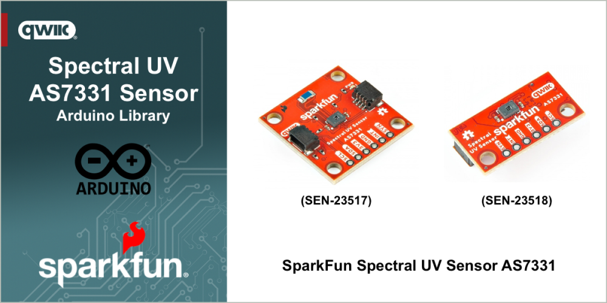

# SparkFun Spectral UV Sensor - AS7331

Arduino Library for the SparkFun Spectral UV Sensor - AS7331 Sensor


The [SparkFun Spectral UV Sensor - AS7331 (SEN-23517)](https://www.sparkfun.com/sparkfun-spectral-uv-sensor-as7331-qwiic.html) and [SEN-23518](https://www.sparkfun.com/sparkfun-mini-spectral-uv-sensor-as7331-qwiic.html) features the AS7331 UV sensor from ams OSRAM©. It measures UV radiation on three channels: UVA (320-400nm), UVB (280-320nm), and UVC (200-280nm) with high sensitivity and accuracy. The three channels on the AS7331 each have individual photodiodes with built-in interference filters. This Mini-sized breakout board is only 0.5in. by 1in. big and has three operating modes: Single Measurement (CMD), Continuous Measurement (CONT), SYNchronized Start (SYNS), and SYNchronized Start & End (SYND), with an automatic power-down sequence between measurements for low current consumption in all three modes.

Looking for the board that matches this library - pick up a [SparkFun Spectral UV Sensor - AS7331 (SEN-23517)](https://www.sparkfun.com/sparkfun-spectral-uv-sensor-as7331-qwiic.html) or a [SparkFun Mini Spectral UV Sensor - AS7331 (SEN-23518)](https://www.sparkfun.com/sparkfun-mini-spectral-uv-sensor-as7331-qwiic.html) at www.sparkfun.com.

## Functionality

This library provides an interface that enables the following functionality when using one of the SparkFun Spectral UV Sensor - AS7331 Sensors:

* Read values from the three UV channels of the sensor (UVA, UVB, UVC) separately or as a combined value
* Adjust the sensors gain values
* Set sensors clock speed and timing values
* Change the operating modes of the sensor
* Control the sensors power-down state
* Change the I2C address of the sensor

## General Use 

The following outlines the general use of the library in an Arduino Sketch. 

### Declaration

At the start of your sketch, the library header file is included using the following statement:

~~~cpp
#include <SparkFun_AS7331.h>
~~~

Before the arduino ```setup()``` function, create a Soil Sensor object in your file with the following declaration:

~~~c
SfeAS7331ArdI2C myUVSensor // Create an instance of the sensor class
~~~

### Initialization

In the Arduino ```setup()``` function, initialize the sensor by calling the begin method. This method is called after the Arduino `Wire` (I2C) library is initialized. 

~~~cpp
// Initialize sensor and run default setup.
if (myUVSensor.begin() == false)
{
    Serial.println("Sensor failed to begin. Please check your wiring!");
    Serial.println("Halting...");
    while (1)
            ;
}
~~~

The begin method returns true if the sensor is connected and available, and false if it is not. If a value of *false* is returned in the above example, the  sketch execution is halted.

After the sensor is initialized, any configuration values are normally set. The following demonstrates how to configure the operating mode of the sensor.

~~~cpp
// Set measurement mode and change device operating mode to measure.
if (myUVSensor.prepareMeasurement(MEAS_MODE_CMD) == false)
{
    Serial.println("Sensor did not get set properly.");
    Serial.println("Halting...");
    while (1)
        ;
}
~~~

The above command sets up the sensor to operate in a *OneShot* mode.

### Usage

#### Read Value

To read a value, the first step is to start a measurement, and wait for at least the sensors "conversion time" to expire. 

~~~cpp
// Send a start measurement command.
if (ksfTkErrOk != myUVSensor.setStartState(true))
    Serial.println("Error starting reading!");

// Wait for a bit longer than the conversion time.
delay(2 + myUVSensor.getConversionTimeMillis());
~~~

Once the conversion period is complete, the values are read from the device with the following command:

~~~cpp
// Read UV values.
if (ksfTkErrOk != myUVSensor.readAllUV())
    Serial.println("Error reading UV.");
~~~

At this point the values from the sensor are available locally in the library and accessed using the following commands:

~~~cpp
Serial.print("UVA:");
Serial.print(myUVSensor.getUVA());
Serial.print(" UVB:");
Serial.print(myUVSensor.getUVB());
Serial.print(" UVC:");
Serial.println(myUVSensor.getUVC());
~~~

The capabilities of this library are far more that outlined in this section. For more information consult the examples that are part of this library or the libraries documentation.

## Examples

The following examples are provided with the library

- [Basic One Shot](examples/Example01_Basic_OneShot/Example01_Basic_OneShot.ino) - This example shows how operate the AS7331 in the default CMD mode.
- [CONT Mode](examples/Example02_CONT_Mode/Example02_CONT_Mode.ino) - Shows how operate the AS7331 in CONT mode. The break time register sets the delay between measurements so that the processor can read out the results without interfering with the ADC. 
- [SYNS Mode](examples/Example_03_LEDFlashMoisture/Example_03_LEDFlashMoisture.ino) - Shows how operate the AS7331 in SYNS mode. This uses the active low SYN pin to start the conversion and relies on an interrupt to signal the end of conversion.
- [SYND Mode](examples/Example04_SYND_Mode/Example04_SYND_Mode.ino) - Shows how operate the AS7331 in SYND mode. This uses the active low SYN pin to both start and stop the conversion. The conversion time is calculated and stored in the `measures.outputConversionTime` field in units of number of clock cycles.

## Documentation

The full API and use documentation for this library is provided [here](http://docs.sparkfun.com/SparkFun_AS7331_Arduino_Library/). For a quick reference, the main methods available in the library are listed [here](https://docs.sparkfun.com/SparkFun_AS7331_Arduino_Library/class_sfe_a_s7331_ard_i2_c.html).

Curious about the hardware this board works with - visit the SparkFun Spectral UV Sensor [hardware repository](https://github.com/sparkfun/SparkFun_Spectral_UV_Sensor_AS7331).

The Hookup Guide for the SparkFun Spectral UV Sensor is available [here](https://sparkfun.github.io/SparkFun_Spectral_UV_Sensor_AS7331).

## License Information

This product is ***open source***!

This product is licensed using the [MIT Open Source License](https://opensource.org/license/mit). 
